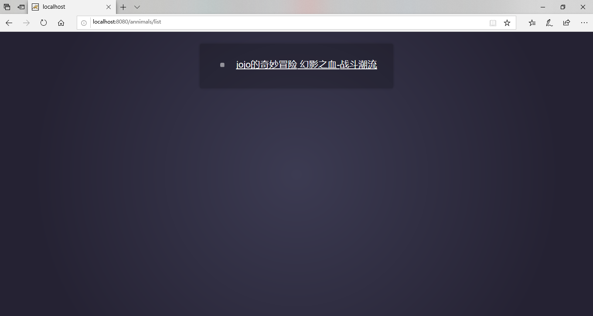
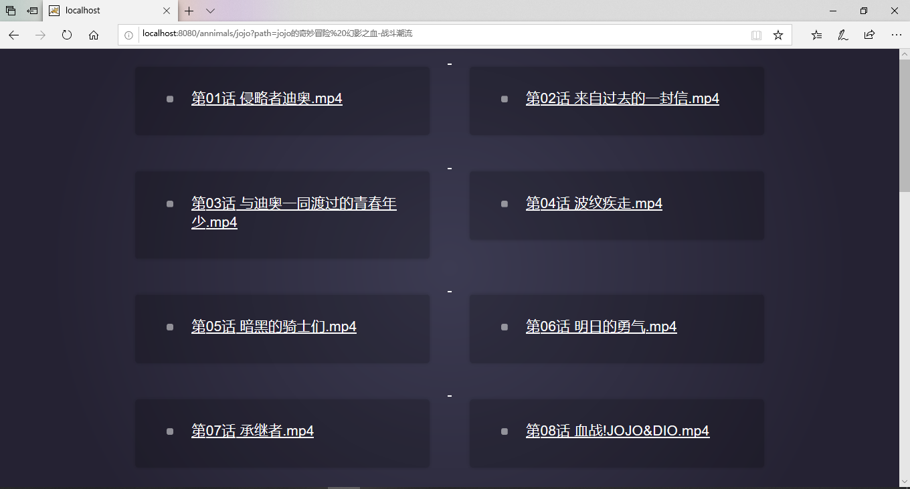
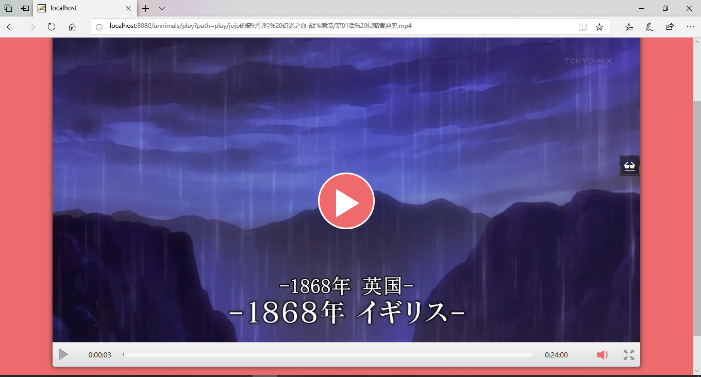

基于Spring Boot改的一个WEB版本的视频播放器. 

Q1：项目简介? 
A1：女朋友要看JOJO的奇妙冒险 然后找了半天没找到合适的我就写了一个 不然就需要开通优酷和B站的会员 本身是腾讯视频会员 开这么多有点烦躁就写了一个. 

Q2：实现思路? 
A2：请求列表加载tomcat(这里以tomcat为例) webapp目录下的play 文件夹
遍历第一层文件夹作为剧集 

请求剧集详情拿到当前剧集下的所有 文件 作为剧集的详情列表（点击过的都会A标签变色） 

选择指定集播放（播放不支持上次看到继续看） 

PS: 非常简单的一个实现,一个JDK一个容器就能跑得起来 适配移动端.

Thank you.
